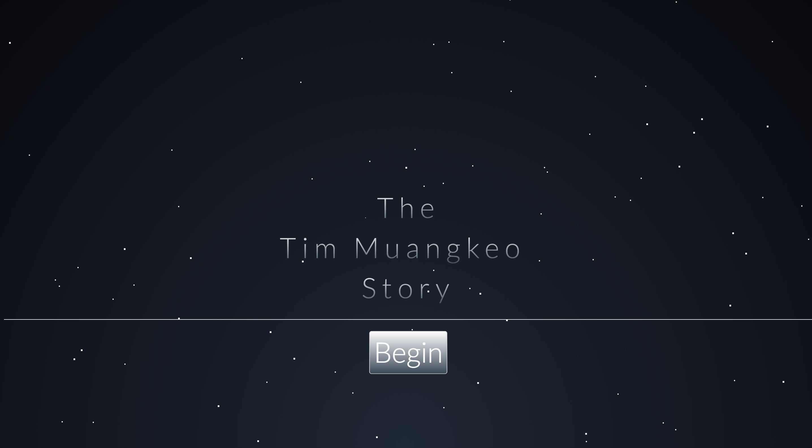
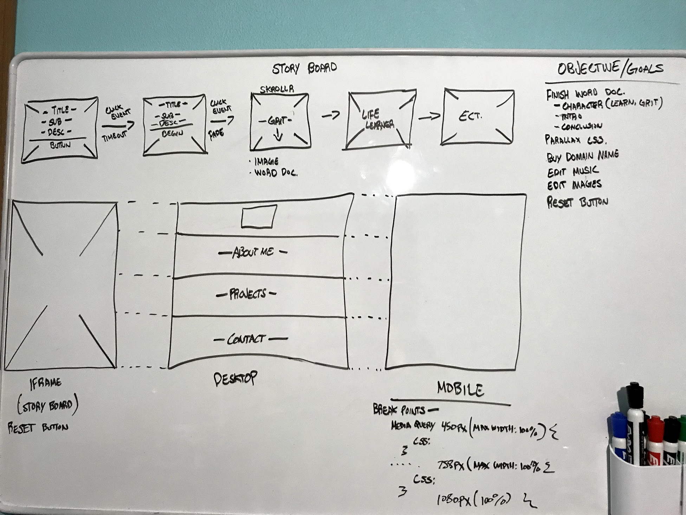
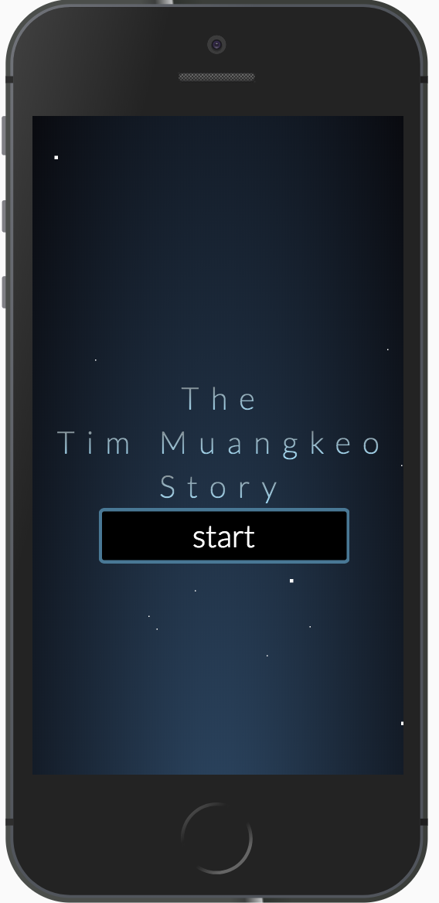

<h1>The Tim Muangkeo Story</h1>
<h2>Hey there! So, you want to get to know me? Well you’ve come to the right place. Hopefully you stick around and read my whole life’s story and how I got to where I am today (2017). </h2>
<h3>This whole project will be done using pure straight vanilla JavaScript...And with a little help of Bootstrap Skrollr.</h3>
<h1><a href="https://ttmuangkeo.github.io/whoistimmuangkeo">View Here</a></h1>

<h3>Mobile Friendly!</h3>

<h3>More Content</h3>
<h4>Coming Soon..</h4>